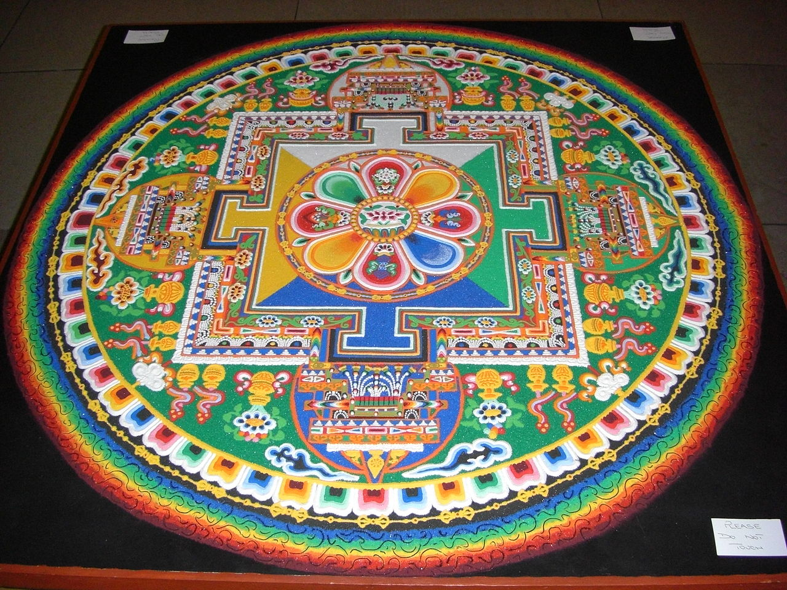
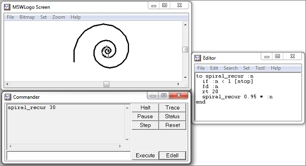
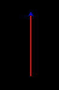
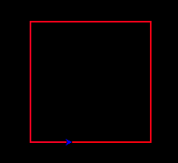
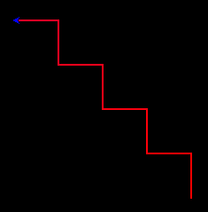
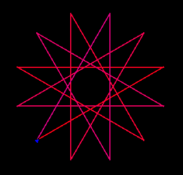
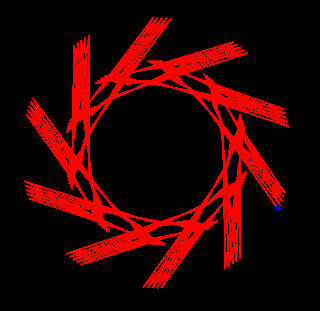
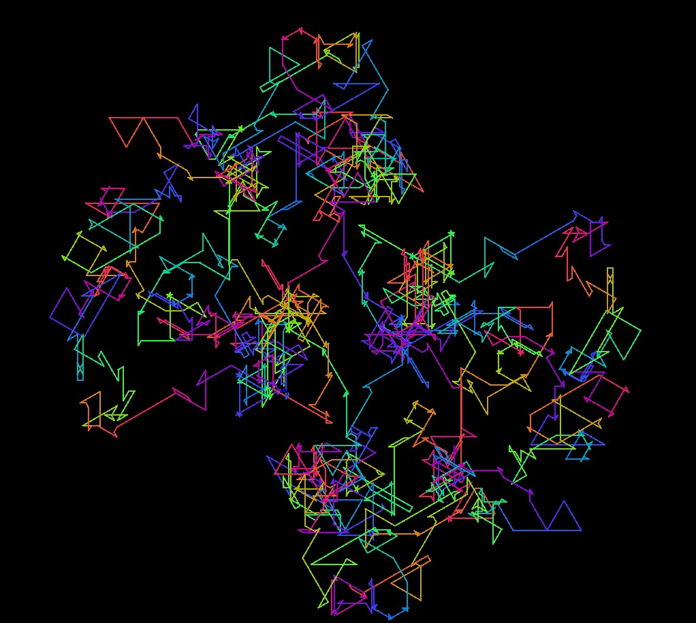

| Tidal Cyclist | Saachi Kaup                                              |
|--------------:|:---------------------------------------------------------|
|           aka | SaachiKaup                                               |
|      Comments | [Club Tidal Forum Thread](https://club.tidalcycles.org/) |

This year, I made a project involving Tidal Cycles and Mandalas for [Summer of Haskell](https://summer.haskell.org/). As you may well know by now, TidalCycles (or Tidal for short) is a software for making patterns with code. It is used to create patterns of many kinds, from music and visualisations to dance moves for robots. Tidal uses a paradigm called Functional Reactive Programming ([FRP](https://wiki.haskell.org/Functional_Reactive_Programming)) under the hood. This is useful for acts involving continuous time, including composing [music](https://www.cs.yale.edu/homes/hudak/Papers/HSoM.pdf) and [animations](http://conal.net/papers/icfp97/icfp97.pdf). 

## Mandalas

[Mandalas](https://en.wikipedia.org/wiki/Mandala) are geometric designs, created with circles and repeated simple shapes. Weaved squares, concentric circles, intricate triangles and squiggly lines form the piece. They are common in south east asian art, showing up in temples and sand paintings alike. Today they are widely used, to the extent that you find them on shirts and household items.

All the Tidal visualizations I saw were linear. Notes playing forward with time. But mandala art remains _in the same place_. The shapes morph in place, accompanying the rhythms and cycles of the music. The periodic nature of music should reflect in its visuals as well. Thus came the project idea: 

> Map the underlying structures of Tidal to mandala patterns.


## Background 
From all that I found out about mandalas, they are general patterns. They are not really particular to India or any other country. Native American art has some mandalas, so does Tibetan sand art.



_Tibetan monks take days to painstakingly make these sand paintings. After a while, they let the tides wash over them_

Not unlike [euclidean rhythms](https://cgm.cs.mcgill.ca/~godfried/publications/banff.pdf), the underlying structures make the art universal. However, their mathematical symmetry, though obvious, remains undefinable. Mandala art in computers is formed usually through an exploratory process, going back as far as we have generated graphics. Speaking of computers generating graphics:

### Fractals 

Some mandalas are fractal. It's an aspect of their underlying
mathematics. Arthur C Clarke noted an odd coincidence when he wrote
about mandalas -

> "\[..\] but indeed the Mandelbrot set does seem to contain an enormous
> number of mandalas."


_Mandalas and Fractals: Visual similarity is obvious._

### Languages 

Languages like [Processing](https://processing.org/) or libraries such as
[p5.js](https://p5js.org/) can produce mandala graphics.\
So why Haskell?
No doubt, the heavy workload should be handled by languages more suited
to the task. Even Haskell animation libraries are built as thin wrappers
on top of the C animation library [OpenGL](https://www.opengl.org/). 

But [Haskell](https://tidalcycles.org/docs/innards/haskell/) is particularly well suited to representing these abstract
patterns. Mapping its type system with simple shapes could lead to
varying results. How could it be used to map Mandalas onto the existing
structures of Tidal Cycles?

## Turtle Graphics 
Turtle Graphics are a simple graphics system. Typical commands include
move forwards, move left, right and so on. Some of you might be familiar
with it from Python\'s Turtle graphics library. For the old school ones,
Microsoft\'s Visual Logo might ring a bell.



_MSWLogo Interface_

Alex and I thought a simple turtle notation might be a good place
to start. I explored animation libraries like Gloss, Reanimate and
WorldTurtle. [WorldTurtle](https://hackage.haskell.org/package/worldturtle-0.3.1.0/docs/Graphics-WorldTurtle.html#t:TurtleCommand) seemed most suited to the task.

We integrated a basic Turtle Notation within Tidal\'s parser.
Understanding the basics of [monadic parsers](https://www.cmi.ac.in/~spsuresh/teaching/prgh15/papers/monadic-parsing.pdf) proved useful.
The system needed to be portable to other libraries, so we created an
intermediate notation. Thus began the patterns.

### Basic Patterns

```
“f”: pattern, moves forward with time
```



```
“f r”: Moves forward in the first half of the cycle, and then moves by 90 degrees in the second.
```



### Mini-notation Magic

Tidal's [Mini-notation](https://tidalcycles.org/docs/reference/mini_notation/) is used for writing patterns of various sorts
(notes, samples, parameters).

Internally, the mini-notation is parsed as a *shortcut* for a function.
You could otherwise write it using longer *function compositions*.

```
“f <l r>”: Alternatively moves left and right in each cycle's second half.
```



```
“f [f f l]”: Starts forming Mandala like patterns.
```



But there was a problem.

The system is not real time. WorldTurtle's API does not give low level
access to the time at which the pattern is produced. This leads to
graphics that are only theoretically in sync with music. [Gloss](https://hackage.haskell.org/package/gloss-1.13.2.2/docs/), on top
of which WorldTurtle is built, does provide access to time. 

There was also the problem of changing patterns in real time. But, by
storing patterns in mutable, shared variables, we could handle this with
threads. This is a work in progress.

Meanwhile, Some more patterns:

### Ninja Star
```
"f l l [f r r f l l f r r] f l l": Mini-notation magic at hand, again.
```



### Honeycomb

```
"f <l r> f <r l r>"
```


### Demonic

```
append (slowSqueeze "1 3 1" ("[l f, f r]")
```


### ChaosMap

```
slow “1 1 2 3 5 8” “f l l”: Everything is patternable.

```
At it's base, `“f l l”` on its own produces a simple triangle.

This pattern will slow down each cycle by the first pattern. Slow the first
and second parts of the cycle by 1, third part by 2 and so on.



_A friend who likes physics said it looks like Brownian motion._

You can find more patterns
[here](https://accidental-microwave-56b.notion.site/Documenting-Patterns-3bd08d813de34185ae517f35adc6909f?pvs=4 "null")


## ANIMATION AND TIME

A [talk](https://www.youtube.com/watch?v=rfmkzp76M4M) by Conal Elliot on [Functional Reactive
Animation](http://conal.net/papers/icfp97/icfp97.pdf) specifies what graphics systems do. They
abstract the pixels away. Keep continuous space to work at a higher
level. This allows for better composition too. You can scale and morph
images without too much difficulty. The task is to use the same methods
for time.

Regardless, some things I have learnt in this time: The rich variety of
[mandala art](https://accidental-microwave-56b.notion.site/Mandalas-Shared-Refs-bf817a8230ca4cfbaa97b95793f5c083) in many continents; \
[L-systems](http://algorithmicbotany.org/papers/abop/abop.pdf)
that produce tree-like structures using grammars and \
Music theory: tones, scales, chord progressions and their mathematical underpinnings.

## What Next? 
There is the intuition we have that fields of knowledge are interlinked.
That these patterns are present in many areas. But you can't work on
intuition alone. So how do you confirm it? 

Well, you can see it. As you watch the pattern form chaotic shapes on a screen, the connection is confirmed. These patterns still have a long way to go. An [FFI](https://ghc.gitlab.haskell.org/ghc/doc/users_guide/javascript.html) could allow JavaScript libraries to produce the animations instead. The new version of Tidal could lead to a new world of possibilities. 

However, the current system does show the structure of Tidal. The ChaosMap pattern, after going haywire in all directions, comes back to its original point. Seemingly random, until the very end when the pattern is visible.  It showcases the underlying mathematical beauty at work. This was the central goal to accomplish. 
