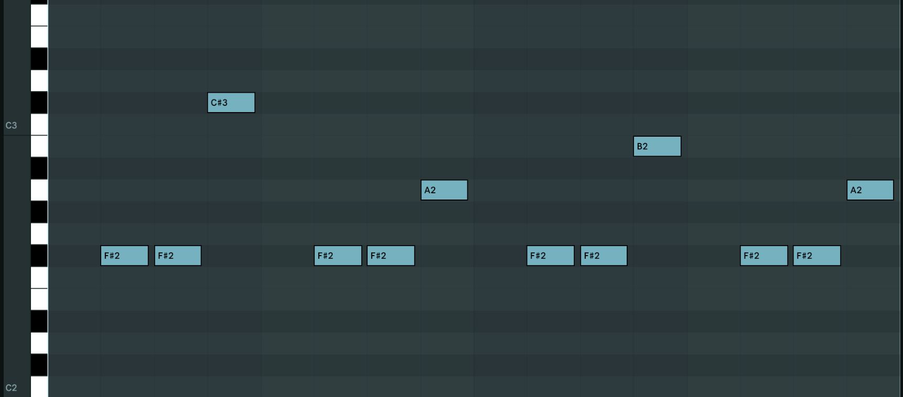

| Tidal Musician | Relyt R    |
| --------:      | :---------- |
| aka            | R Tyler (https://instagram.com/1000instamilligrams) |
| Location | San Francisco, California |
| Album/Release | Xuixo |
| Genre | Xenharmonic, Techno, Algorave, Microtonal |
| Available | [bandcamp](https://relytr.bandcamp.com/album/xuixo), Spotify, Youtube |
| Release Date | June 28th, 2023 |

## Summary

We've been listening to music with the same 12 notes (C, C#, D, Eb, etc.) for hundreds of years, thanks to 18th century Europeans. Times have certainly changed. Why does our music not reflect that?

A small but active contingent of artists recognizes and challenges this status quo and creates microtonal music using notes without analogs in 12-tone equal temperament. The name given for music composed with alien, non-12-tone harmonies is 'xenharmonic'.

Xuixo, an EP released on the xenharmonic label [split-notes](http://split-notes.com/) is the first studio EP by Relyt R, the alias I created for microtonal algorave. Relyt R is a focused split from my other algorave work as [R Tyler](https://instagram.com/1000instamilligrams).  The Xuixo EP features algorithmic and machine learning enabled techno and dance music using non-Western tunings.
  19-, 21-, and 33-tone equal temperaments were chosen to synthesize alien harmonies and melodies with notes exterior to the common 12.

My motivation for incorporating live-coding, machine learning, techno,  and xenharmonic scales is to imagine how music in the future may exist--with a radically different sonic palette. The intention behind Xuixo EP was to use this set of digital tools and custom code bases to evoke wonder about an algorithmic future.  Perhaps the future will be alien and dystopian. If so, a fast, brutal, and bizarre xenharmonic techno soundtrack would be fitting.

### Track Highlights

I'm going to highlight code and methodology behind three tracks, starting with the opener "Nondegenerate", then "Three", and then "10 Megakelvin".  "Nondegenerate" will be the longest description as I'd like to explain the microtonal setup used for throughout my album.

#### "Nondegenerate" (33 EDO)

Opening at 170 BPM, the sub-heavy techno track 'Nondegenerate' in 33 notes per octave (EDO = equal divisions per octave) channels a dystopian sci-fi rave.  The microtunable VST Arturia Pigments is used for all synth sounds, including the arp, chords, and sub bass.  This [list of microtunable VST synths on the xenharmonic wiki](https://en.xen.wiki/w/List_of_microtonal_software_plugins) is how I first heard of Pigments.   
To microtune Pigments I used [Sevish's scale workshop](https://sevish.com/scaleworkshop/?version=2.1.0) and exported a `.scl` file for 33-EDO. To create this tuning file, the steps are:   

`New Scale -> Equal Temperament -> "Number of Divisions" = 33, "Interval to divide" = 2/1 -> Export Scala scale (.scl)`

On this track I controlled Ableton Live with TidalCycles via MIDI and recorded the results. This track was not recorded live--clips from TidalCycles were pieced together over a DJ-friendly arrangement structure.  The rigidity of 8- and 16-bar arrangement structure seems to be foundational or omnipresent in (Western) dance music so I wanted to enforce that structure for this piece.

The way I played and composed the arpeggio in TidalCycles is with several custom functions I wrote (and [one by from polymorphic.engine](https://club.tidalcycles.org/t/pattern-to-list/2982)). They are constructed from base TidalCycles functions `nTake`, `toScale'` (for non-12-tone scales), and `segment`.
Essentially, I use a custom function `takeArp`' to map a math function to a microtonal scale and create an isorhythm out of it. 

A little more detail before I share the code:  I start with a a mathematical trigonometric function, quantize it to a certain number of samples with `segment`, map their values to an ordered set of pitches in a scale (embedded in a 33-note chromatic scale) with `tScale'`, and use [state memory](https://tidalcycles.org/docs/reference/state_values/) (with `nT` derived from `nTake`) so that everytime a rhythmic onset is encountered, the next note is taken from the list (creating an isorhythm).    

Here is the code to make `takeArp'`:

```haskell
let
  -- allows writing patterns (pseudo-patterns) instead of lists.
  -- useful for `nTake` and `toScale` family functions.
  patternToList pat = map value $ sortOn whole $ queryArc pat (Arc 0 1)
  -- toScale' but with pseudo-pattern syntax
  -- zEDO is the EDO; the number of notes in the non-12 chromatic scale.
  tScale' zEDO scalePat pat = toScale' zEDO (patternToList scalePat) pat
  -- nTake but with pseudo-pattern syntax and a number to take.
  -- requires a name for the state counter.
  nT name amt p = nTake name (take amt (cycle (patternToList p)))
  -- the 6-argument function that combines everything above.
  takeArp' name amt edo scalePat segAmt func =
      nT name amt $ tScale' edo scalePat
      $ fromIntegral <$> round <$> segment segAmt (func)
```

Then I can convert trig functions into scale-based state-memory arpeggios:

```haskell
d1 $ struct "t(13,16)" $ takeArp' "nondegenerate" 9 33 
     "0  3  8 12 22 24" 15 (slow 3 $ range (-5) 8 $ sine*sine) #
     s "midi" # midichan 1
```

This function lets you dramatically change the melody by changing either the trig function, its range, its segmentation, the scale itself, the number of values taken, and the rhythmic onsets (specified here using `struct`). 

This is not the exact code I used for the melody (I lost the code with `:q!`) but it is close.

I'll briefly go over chords, bass, and production before next track. This section goes into a bit of microtonal theory, then plug-ins and techniques used for production.

The chords stabs have the pitches `[0, 4, 9, 14, 22]` in 33-tone, so root, neutral second, Just minor 3rd, perfect 4th, minor 6th.  It's a kind of a second-inversion minor 7 with a neutral sixth.  I find the [EDJI ruler](http://micro.soonlabel.com/Scott_Thompson/edjiruler.html) to be very helpful for learning a new temperament.
 I also use some [custom Python tuning tools](https://github.com/TylerMclaughlin/tuning_tools) I made to [convert 12-EDO pitch classes to non-12-EDO approximations](https://github.com/TylerMclaughlin/tuning_tools/blob/master/twelve_to_edo_alternatives.py).

The bass pattern is simple, with a steady stream of 16th notes except there are no 16th notes on the quarter note onsets where the kick drum plays.  This makes the kick and bass sound more like a single instrument and helps with mixing.  Here's the pattern visualized on a piano roll: 

. 

To compose the melodic contour in this bass ostinato, I used theory from Lerdahl and Jackendoff's 'generative theory of tonal music', namely the `4 1 2 1 3 1 2 1` pattern found in music and linguistics (refer to G. Toussaint's 'Geometry of Musical Rhythm' for an accessible intro). TidalCycles mininotation makes this almost effortless:

```haskell
n "~ 0 0 <<7 5 > 3>"
```

Regarding the microtones in the bass, the notes divide 2.5 semitones (seven 33-EDO steps) into four pitches so it's quite microtonal yet it's still perceived as four distinct pitches.  For an interesting timbral effect, I layered two bass oscillators, with the second pitched 15 33-EDO steps apart (545.5 cents, an approximation of the 11th harmonic). This harmonization really makes the bass shine and sound cool on trashy speakers.  The harmonic series is a useful reference when sound designing percussion and bass.

For mixing and production, I used drum bus limiting, multiband sidechaining, mid-side EQ, a mastering chain with the stock Ableton limiter, Rift by Minimal Audio for distortion on the chords and hi-hats, and Output Portal for delay effects. For sub and bass compatibility, I followed Slynk's recipe for [making sub bass sound good on any sound system](https://www.youtube.com/watch?v=ecKbeDfJxtQ). 

#### "Three"

The experimental club track "Three" was my first production after I coded a machine learning tool in Python I named [WAV Clustering Workflow](https://github.com/TylerMclaughlin/wav_clustering_workflow) (WCW) for clustering drum samples by acoustic similarity. 
 I used WCW to cluster [18000 vintage drum machine samples from kb6](https://samples.kb6.de/) and browsed the generated file folders corresponding to clusters (see WCW readme for more info). 
 One of the cluster folders in particular was full of insane laser sound effects, so I simply played through them, in order more or less (hierarchical clustering means within a cluster, sounds are further sorted by subclusters). To play sounds I drag 128 samples at a time in an Ableton drum rack then play them in order with 

```haskell
fast 16 $ slow 128 $ n "0 .. 127" # s "midi" # midichan 1
```

For the stereo-panned stream of ultra-compressed bass notes at around the 1:20 timestamp, I actually play all 128 sounds in order, and kept all the samples that came out of WCW.  It's the sound of a sweep through neighboring notes in a cluster of kick drums in acoustic latent space--very satisfying and wild sounding.  I added OTT (Ableton Live Multiband dynamics) at 100% (haha) then I added binaural panning using the Envelop max4live device on this and other instrument tracks, with LFOs controlling the X and Y coordinates.

I also used a NEJI tuning (near equal just intonation, a concept I learned from Zhea Erose in the Xenharmonic Alliance discord) using my [NEJI calculator](https://github.com/TylerMclaughlin/neji_calculator) to export a scala file for the wobbly vocal-like chord that's played in bursts of 7 (starting at 0:03 timestamp).

In a slower track like this, groove is really helpful (via `nudge` TidalCycles functions or Roger Linn's MPC 16 grooves in Ableton).  The composition isn't that crazy, but it's the machine-learning for sound selection and overall contrast that makes it interesting.  

#### "10 Megakelvin" (21 EDO)

This track was fully live-coded in TidalCycles with minimal or zero tweaks after recording. I used a 21-EDO .scl file from Sevish's scale workshop and microtuned several instances of Arturia Pigments, similar to how I set up synths for "Nondegenerate" above and for other tracks on the album.  I decided to use an 18-beat rhythm because it's close to 16, and it's still an even number, so it's still amenable to head-nodding and/or dancing. 

 Saying 'no to twelve notes' and 'no to 16 beats' resulted in something incredibly bizarre. When I began this production, I was inspired by the sound design of the late producer Qebrus. But what I arrived at was something completely different.


The TidalCycles code for this track is about 100 lines. It makes ample use of the non-default TidalCycles function `ncat` written by pulu on the TC discord. 

```haskell
let ncat = seqPLoop . go 0                                                        
      where                                                                       
        go _     []          = []                                                 
        go t_acc ((t, p):ps) = (t_acc, t', p) : go t' ps                          
          where                                                                   
            t' = t_acc + t
```

It's basically `cat` but you specify how long the subpatterns last (see code below for usage).
`ncat` allows me to spread a bunch of wild and contrasting sounds over a long cycle, and it's fun for improvising because you can change how long any one of the subpatterns lasts, and doing so shifts all the other patterns. In "10 Megakelvin" I use `ncat` to interweave drum samples from from the Modular Drums from Mars collection together with extremely sci-fi microtonal chords.  I've found the main utility for this kind of horizontal sequencing and concatenation is it makes things more monophonic and musical (one idea at a time).  I find regular `cat` to be maybe too predictable or constant.  Here is most of the code I used for "10 Megakelvin":

```haskell
setcps(70/120)

-- pitch notes down by 24 semitones for ableton drum racks so 0 = C1 
let drumz = (|- n 24)

-- sparse modular drum sounds and xenharmonic arpeggios
d1 $ every 5 (|+ n 3) $  mask "~ t t ~" $ ncat [
     (1.5, n (tScale' 21 "0 5 7 12 17 28" "0 .. 17") # m 2 ),
     (0.5, drumz $ struct (timeline [5,3, 3, 7]) $ nT "mdfm" 14 "0 .. 14" # m 3),
     (0.5, n (tScale' 21 "0 5 7 12 17 28" "0 .. 17")  # m 4),
     (1.5, drumz $ struct (timeline [5,3, 3, 7]) $ nT "mdfm" 14 "0 .. 14" # m 5),
     (1, n (tScale' 21 "4 5 8 12 17 28" "0 .. 17") # m 2),
     (1.0, drumz $ struct (timeline [5,3, 3, 7]) $ nT "mdfm" 14 "0 .. 14" # m 3),
     (0.5, n (tScale' 21 "0 5 7 12 17 28" "0 .. 17")  # m 4),
     (1.0, drumz $ struct (timeline [5,3, 3, 7]) $ nT "mdfm" 14 "0 .. 14" # m 5),
     (0.5, drumz $ struct (timeline [5,3, 3, 7]) $ nT "mdfm" 14 "0 .. 14" # m 1)
] # amp "0.6 0.2!5  0.6 0.5!5 0.6 0.5!5"


-- 18 beat two step rhythm.  1 = kick, 8 = hi hat, 3 = clap
d2 $ drumz $ n "1 ~ 8 ~   8 ~ 8 ~ 8  [1, 3] ~ 8 <~0>  8 ~ <~[8,0]> ~ 8 " # m 1


-- bass, toms, sci-fi chords, drum break with bongos
d6 $ every 5 (rev) $ every 9 (mask "~ t") $ every 7 (fast "<1.0 1.0 1.00  1.0>") $ stack [
    ncat [
     ( 7, struct "~ t t ~  t t ~ t   t t t ~   t t ~ ~  t t" $  nT "c" 4 (tScale' 21 "0 3 6 9 12" "0 .. 8") # m 6),
    (1, n (tScale' 21 "0 3 6 9 12 15 18" "[0, 1, 2, 3, 6, 7, 8]" |+  "<5>") # m 7),
     ( 7, struct "~ t t ~  t t ~ t   t t t ~   t t ~ ~  t t" $  nT "c" 4 (tScale' 21 "0 3 6 9 12" "0 .. 8") # m 6),
    (1, n (tScale' 21 "0 3 6 9 12 15 18" "0") ),
    (1, n (tScale' 21 "0 3 6 9 12 15 18" "[0 2  6 8](12, 18)" ) # m 8),
     ( 1, struct "~ t t ~  t t ~ t   t t t ~   t t ~ ~  t t" $  nT "b2" 4 (tScale' 21 "0 9 6 3 0" "0 .. 8") # m 6)
    ],
    mask  "t t" $ mask "<~t> ~ t <t ~ ~ ~>" $ every 7 (|+ n 1) $  drumz $ n "[<10 8 8 8 8 8 8 8>*2]!9" # m 1,
    -- sliced up acoustic drum break with bongos
    drumz $ every 5 (|+ n 12) $ (|+ n 2) $ n "0 .. 17" # m 9
]

-- drum break only
d9 $ drumz $ every 5 (|+ n 12) $ (|+ n 2) $ n "0 .. 17" # m 9

```

I'll conclude this section with some notes on my production workflow.

 I tend to mix, compress, and limit as I'm composing and coding. I use a technique called 'Brauerizing' where I group different instruments (drums, basses, melodies, harmonies) and compress and limit them each individually. Then I compress and limit on the master bus.  This glues the sounds together hierarchically and makes all the elements interact dynamically.  I almost consider it part of the composition because you need to consider: how much do you want your independent signals to overlap, where do you want negative space, etc. 

This track "10 Megakelvin" is unusual because I didn't use any distortion, just heavy amounts of compression and a little Valhalla Reverb. For ear candy, I put an unsynced LFO on the cutoff frequency of a low-pass filter on the acoustic drum break--this really makes loops sound less repetitive and makes the track sort of wash and swell. 
On the hi-hats I use a free max4live device called 'Granular Mirror Maze' that I heard about from a reddit AMA with Max Cooper.  It gives these drums a really unique metallic sound that's distinct from normal stereo delay with feedback.

### About Relyt R

Relyt R is my new alias, the alter ego of Silicon Valley algorave artist and [AV Club SF](https://avclubsf.com) performer [R Tyler](https://instagram.com/1000instamilligrams). While R Tyler is influenced by jazz, prog, house, classical, and videogame music, Relyt R is a compartmentalized alias for techno at higher BPMs, alien and futuristic sounds, brutalist sound design via machine learning, and xenharmonic composition. 
 
Xuixo is my first release under this new alias, and I am fortunate to have had it released on [Sevish's xenharmonic label split-notes](http://split-notes.com). 
I have been producing xenharmonic dance music since 2017 and live-coding music in TidalCycles since 2018. 
 Beyond the topics in this blog post, I am captivated by sea creatures, 3D art, and molecular biology.  I'd like to thank the friends who have helped me along the way to this release. And especially those who acquiesced to offering an initial vibe-check and listened to my EP when it was still a demo.

