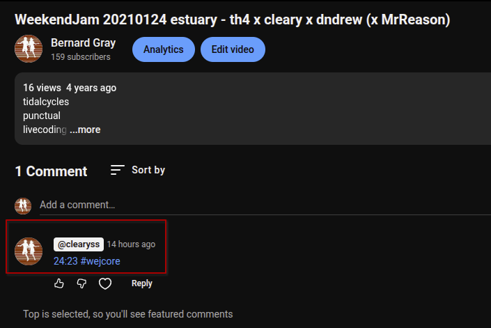

| Author        | Bernard Gray                                             |
|--------------:|:---------------------------------------------------------|
|           aka | cleary                                               |
|      Comments | [Forums](https://club.tidalcycles.org/t/estuary-jams/2336/70) or [Discord](https://discord.com/channels/779427371270275082/779481771388698664) |

## Preamble

In November 2020, [@Jeff Holtkener](https://club.tidalcycles.org/u/crashingbooth/summary) ([@crashingbooth](https://crashingbooth.bandcamp.com)) put a call out on the tidalcycles forums for [expressions of interest in setting up a regular Livecoding jam session](https://club.tidalcycles.org/t/estuary-jams/2336). By this time COVID lockdowns were in full force, and people were desperate to find ways to hang out and socialise, [Agathe Herou](https://club.tidalcycles.org/u/th4/summary) [(@th4)](https://th4music.bandcamp.com/music) [coined the name WeekEndJam](https://club.tidalcycles.org/t/estuary-jams/2336/20) and a group of us started hanging and jamming on the [Estuary livecoding platform](https://estuary.mcmaster.ca) every weekend.

## Style

As the world opened up and people's lives returned to (somewhat) normal, the WeekEndJams changed their demographic - the original organisers gradually drifted away, new people would arrive sometimes for one or two jams, sometimes for many.

This meant that the music and visuals was influenced greatly over time by different personalities, as well as the growing flexibility in the Estuary platform (custom samples, new tidalcycles features being imported, the arrival of flok/strudel etc).
Going back and reviewing the recordings is interesting just to see how much has changed between the common samples used then and now (I never expected to miss `arpy`!), and the common functions/code patterns that were/are used, as well as the capabilities of the languages and sharing frameworks.

## What is wejcore?

5 years has passed since the WeekEndJams began, it has run (almost) every weekend since in that period and importantly almost all of those sessions were recorded (barring the odd snafu where the audio was missing... whoops).
With 40-50 hours of recordings each year, there is a huge back catalog of content and I wanted to take stock and try and summarise how it has changed in that time.
To that end, I though **"wejcore"** would be a suitable descriptor ... but what is **wejcore**?

## Help me

I am hoping that I can get some input from the community so that the view of **wejcore** is not limited to my biased perspective.

There are two significant WeekEndJam playlists on Youtube (please let me know if there are more recordings floating around!):
- [Nov 2020 - Feb 2023](https://www.youtube.com/playlist?list=PLt8O3WdGnQjfCNVBK2O0W0_nwiSgWIoFR)
- [Mar 2023 - ongoing](https://www.youtube.com/playlist?list=PLMBIpibV-wQLvP7jitjnV9E61DfV11235)

I was hoping that together as a group we can simultaneously define, and announce the genre of **wejcore** by commenting on these videos with a timestamp and hashtag `#wejcore` at points in the video that you think are representative of the style and period of WeekendJam (and if you concur with a comment, give it an upvote)

The things that you might consider representative do not have to be the common patterns or samples used, but possibly the accidental interjection of some overly loud sample (everyone did this at least once), or the specific way estuary would start to break down when it was overloaded vs flok/strudels breakdowns, or even something like the session getting stuck for way too long on some simple loop while we chatted about other stuff... if you want to elaborate on why you think some point in the video is `#wejcore` add it to the comment (or tell me, whatever)

## Then what?

I plan to do a (free) release on bandcamp under the [WeekendJam](https://weekendjam.bandcamp.com) name. It will be a series of volumes (roughly separated by year? TBD) combining musical snippets/snacks into a compilation of `#wejcore` tunes as defined by whoever gets involved, to provide a condensed overview of the way the collab livecoding sessions have changed and morphed over the years. I'll assemble a partner video playlist to go with it too, since the evolution of visuals in the jams has been a pretty amazing journey and needs to be included. 

## How long have I got?

There's a lot of content to get through - if I'm seeing tags being added regularly I'll wait until that dies down a bit. Maybe aim for Jan/Feb 2026 as a rough guide to do the first volume release.

## Thanks

Thanks!

