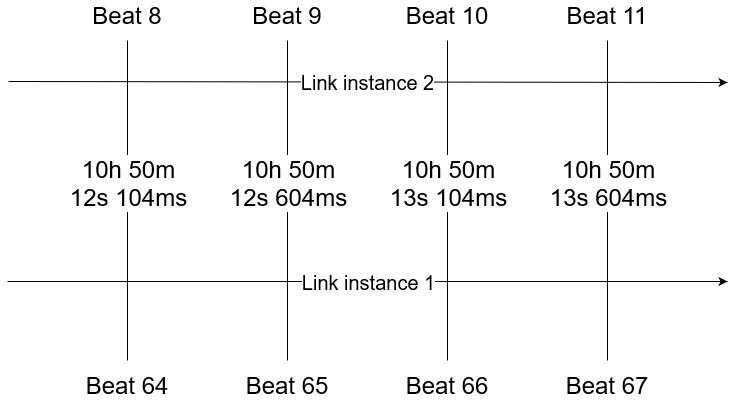
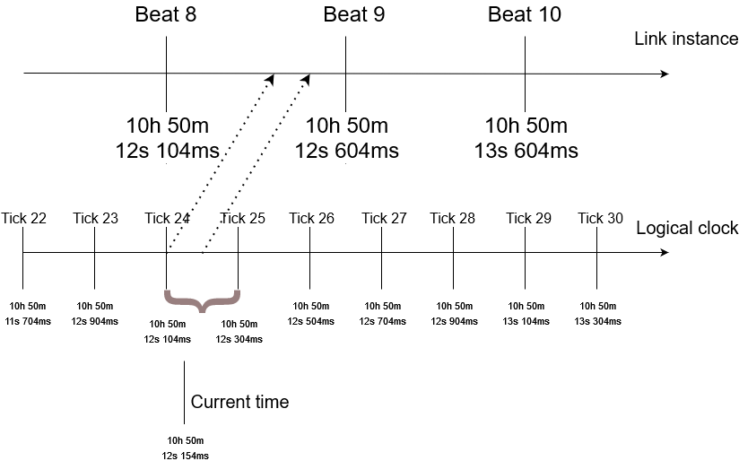

## Introduction

Hello, I'm Pierre Krafft, aka Zalastax, a software engineer and hobby-musician from Gothenburg, Sweden. I've been enjoying Tidal since late 2021 after first dabbling a bit with Orca and, way before that, Sonic Pi. I primarily use Tidal to control hardware synthesizers using MIDI. Tidal is a really neat sequencer and I think there's a lot of untapped potential which I hope to explore more in the future.

This post shares my experience of replacing a significant part of the Tidal internals.
What I achieved is a direct integration from Tidal with Link,
which is a library for synchronizing musical time between applications.

In this post, I'll explain why Link integration was important to me,
provide an introduction to Tidal internals (with a focus on scheduling),
some important concepts of Link,
and how I overcame some really tough challenges!

## The idea
I make music with friends who use traditional synth setups.
To have our synths play in sync, we connect them over MIDI.
But when I started using Tidal,
setting up the MIDI clock was not so convenient and I was afraid of it crashing, which would stop the show for everyone.
So I started looking for a way to have a stable MIDI clock
and connect it with Tidal.
Soon thereafter, I learned about Link.

The purpose of Link is to "synchronize musical beat, tempo, phase [...] across multiple applications running on one or more devices." Unlike traditional MIDI clock synchronization, which relies on a single device acting as the master clock and sending timing information to all connected devices, Link uses a peer-to-peer network protocol to allow all devices to communicate with each other and agree on a common tempo and beat phase. This allows for more accurate and stable synchronization between devices, even if the tempo changes or if devices are added or removed from the network. Additionally, Link provides a way to sync devices wirelessly, eliminating the need for physical connections between devices.

My idea was to have some application listen to the MIDI clock and use Link to sync Tidal with that MIDI clock.
I learned later that Link is not meant to be used that way,
but the idea got me started on integrating Tidal with Link...

## I get started

November 2021 is the start of my journey for adding Link support to Tidal.
I started discussing the path forward with Yaxu, Tidal's inventor, in two Github Issues ([1](https://github.com/yaxu/hylia-haskell/issues/1), [2](https://codeberg.org/uzu/tidal/issues/660)).
Yaxu had already done some thinking about adding Link to Tidal and he had also done some exploration that I could learn from.
His positive responses motivated me and brought me confidence that this was a pursuit worth taking!

One of the main challenges of integrating Link with Tidal was that Tidal is written in Haskell, while Link is a C++ library. I knew that C++ libraries can be exposed as C libraries, and Haskell can interact with C libraries through a mechanism called the "Foreign Function Interface" (FFI), but I had never done so before.
Nonetheless, I set out to create a basic Link integration in Haskell and I fairly quickly had something that compiled.
In the world of Haskell, this is often a huge success which means you can pack up - work's done!
But in this case, work was far from done...

## Challenges

Some parts of the Link library was working, but when calling the crucial code `this->link.enable(true);`, GHC (the Haskell compiler / interpreter) crashed.

Debugging internal GHC crashes is tricky for most people, so I made many twists and turns to find out what might be wrong.
Several long nights were spent reinstalling Haskell and battling build system configuration.
The full details are documented in [the issue for Link support in Tidal](https://codeberg.org/uzu/tidal/issues/660), but the short story is that I found out that could avoid the crash by including Link as a shared Library.
This workaround was not suitable for the final release of Link support, but it let me continue the work.

After making great progress on the Link integration, I became ready to start replacing the workaround.
6 weeks into my ambitious project, I was ready to report an [issue to the Haskell maintainers](https://gitlab.haskell.org/ghc/ghc/-/issues/20918).
I reported that my program worked when using `cabal v2-run` but not `cabal v2-repl`.
Since Tidal uses GHCi (the REPL), this problem was crucial to resolve.

Several GHC maintainers pitched in, offering suggestions and trying to reproduce my issue.
Unfortunately, I could reproduce the issue, but the GHC maintainers were not as successful so interest faded.

I went ahead and reproduced the issue several times, but only on Windows - not Linux, and even got a friend to reproduce it on their machine.
However, this did not immediately rekindle the interest of the maintainers.

I started digging deeper to identify the root cause.
First by using WinDbg, but the call stacks and multiple threads were too convoluted for me to digest.
So I resorted to print-debugging, working my way through the C++ code, adding printouts everywhere.
Soon thereafter, I had my eureka moment!
I isolated the issue to be caused by using C++ Exceptions!
Even caught exceptions caused issues for GHCi, but not for the compiled executable.

I could now provide a [minimal example](https://github.com/Zalastax/ghc-bug-20918) and, one day later, a Haskell maintainer replied with a [detailed analysis](https://gitlab.haskell.org/ghc/ghc/-/issues/20918#note_414002), which I quote here in full:
> The RTS's Runtime linker doesn't support C++ exceptions on any platform in non-dynamic way. Historically we've never needed to as not many C++ code was being used.  It works on Linux because it defaults to dynamic way, which gets the system loader to handle the heavy lifting.
>
> On Windows we don't handle .xdata and .pdata sections, so once you get an exception the OS unwinder asks us if we can handle the exception and we say no and move on and the crash occurs. You don't see GHC's panic message because the dynamic code is created outside of GHC's VEH region.
> 
>> If I instead build a .dll and make my FFI calls towards that .dll, the code does not crash in GHCi
>
> Yes for the same reason as it works on Linux, the exception will be handled by the system unwinder.
>
> Now supporting this on Windows these days is a lot easier than it used to be.  GHC Already has a native exception handling in place for itself in the VEH handlers. and we've dropped support for x86. x86_64 uses exception tables but gives us an easy way to extend the exception tables for dynamic code like JITed code.

3 months later, the issue was fully fixed and ready to be included in GHC 9.4.2.
This let me finally remove the workaround, use Link directly instead of as a shared library,
and integrate my work to the Tidal repository.
This bug in GHC is the reason Tidal 1.9 requires GHC 9.4.2 or later on Windows.

I'm very proud of my perseverence to resolve this issue.
I started my attemps late November 2021 and merged the code to Tidal early July 2022.

## Link and Tidal integration: Architecture Overview

The integration of Link with Tidal posed several challenges but the end result was a success. In this section, we provide an overview of the architecture of the Link and Tidal integration and discuss the design choices made along the way. This information can serve as a guide for those who wish to create their own Link integration in different projects.

### Tidal Innards

Let's start by exploring some Tidal Innards. For a more complete reference, please refer to [What is a pattern?](https://tidalcycles.org/docs/innards/what_is_a_pattern).

Some important concepts in Tidal innards are Arc, Part and Event:
```
-- | A time arc (start and end)
type Arc = (Time, Time)

-- Tidal often needs to represent a Part of an Arc.
-- It does so with two arcs, the first representing the whole of the part,
-- and the second the part itself.
-- Often both arcs will be the same,
-- which simply means that we have a whole that has a single part.
--
-- | The second arc (the part) should be equal to or fit inside the
-- first one (the whole that it's a part of).
type Part = (Arc, Arc)

-- | An event is a value that's active during a timespan
type Event a = (Part, a)
```

Tidal processes musical patterns by querying for all Events within an Arc.
The Events returned by the query are distributed to targets such as SuperCollider.
These details remained unchanged when moving to Link as the base for the scheduler.

### Link Concepts

The Link API is responsible for converting between beats/cycles on a shared timeline and a clock that corresponds to when the sound should play from the speaker.
The concept is visualized in a timeline diagram below.
Two Link instances are shown.
The top and bottom of the diagram show how the two instances have their own beat counter.
However, the beats have a shared phase - they align over bar or loop boundaries.
I created the diagram below with alignment every 8 bars.



The API between Tempo.hs and Stream.hs hides how Link is called.
This helps separate concerns but could also enable alternative time keeping mechanisms.
It should not be too difficult to implement the API using the local system clock and memory to keep track of a local timeline.
Please reach out if you would like to create such an implementation!
Doing so could open the door for adding back other synchronization mechanisms again :)

The API between Tempo.hs and Stream.hs includes the following operations:

```
data LinkOperations = LinkOperations {
  timeAtBeat    :: Link.Beat -> IO Link.Micros,
  timeToCycles  :: Link.Micros -> IO P.Time,
  getTempo      :: IO Link.BPM,
  setTempo      :: Link.BPM -> Link.Micros -> IO (),
  linkToOscTime :: Link.Micros -> O.Time,
  beatToCycles  :: CDouble -> CDouble,
  cyclesToBeat  :: CDouble -> CDouble
}
```

#### Calling the Link API from Haskell

As mentioned in [Troubles](#Troubles), Link is a C++ library and the Haskell integration is done using the "Foreign Function Interface" (FFI).
Haskell has some support for integrating directly with C++,
but it seemed too difficult to use for my taste.

Fortunately, while I was working on my implementation,
Link released a C-wrapper of their library.
Integrating with C-libraries from Haskell is fairly easy,
and mostly comes down to setting up the compiler correctly and defining the C-functions in a .hsc-file.

Conversion is straight forward:
```Haskell
-- Haskell
data AbletonLinkImpl
data SessionStateImpl

newtype AbletonLink = AbletonLink (Ptr AbletonLinkImpl)
newtype SessionState = SessionState (Ptr SessionStateImpl)

foreign import ccall "abl_link.h abl_link_commit_app_session_state"
  commitAppSessionState :: AbletonLink -> SessionState -> IO ()
```

```C
// C

 typedef struct abl_link
  {
    void *impl;
  } abl_link;

  typedef struct abl_link_session_state
  {
    void *impl;
  } abl_link_session_state;

void abl_link_commit_app_session_state(
    abl_link link, abl_link_session_state session_state);
```

### Ticks and Processing Ahead

Tidal needs to process events a few hundred milliseconds early so that the event can reach the sound engine/synthesizer in time.
Otherwise, the event would play late from the speaker, and we would not be synchronized with others in the same Link session.
The processing ahead is configured via `cProcessAhead`.

The scheduler is based on "logical time" that uses a tick based system.
This means that the implementation keeps track of the starting time and the length of each "tick" in order to step time forward in equal chunks.
To turn the tick number into a "logical time", the following formula is used:

```
logicalTime startTime ticks' = startTime + ticks' * frameTimespan
```

Working with logical time / ticks is a common approach to avoid time drifts which I kept from the original scheduler.
I'm not sure how much difference it still makes now that Link does the heavy lifting,
but it felt safest to keep it.

### Putting it together

With the different components explained, I can now explain the whole:
- Tidal processes events ahead of time by querying for events within an Arc that has not happened yet (based on the tick system).
- Processing events ahead of time is common to all Link based systems since it's the only way to not play the sound too late due to the Link API being based on when the sound should play from the speaker.
- The translation from cycles in Tidal to a timestamp is performed by the Link API.

The picture below shows the relation between Link, the logical clock, and the current time.
The current time is greater than the logical time of Tick 24,
which means that we should be processing all Events that happen between the Arc `(Tick 24,  Tick 25)`.
We query for all Events within this Arc and convert the start and end cycle of each Event to a clock time by using the Link API.
As mentioned earlier, the events that we currently query for should all happen in the future.
This is why the mapping from Logical clock to Link instance time is a diagonal arrow that goes forward in time.




### A note about multithreading

The scheduler runs in a separate thread, so Tidal is multithreaded.
This follows the approach used by the previous scheduler and ensures that the GHCi REPL keeps being responsive.

The original design used several MVars to copy data between processes.
MVars are a concept from concurrent Haskell.
They act as synchronising variables and are used for communication between concurrent threads.

However, the design based on several MVars made the code difficult to follow and hard to verify for correctness.
In the new design, we communicate between threads using a list of actions, similar to dispatching Actions to Redux in JavaScript or calling an actor in Erlang.
This puts all the tricky logic that deals with the internal state in a single place.
Following this approach makes the code much more easy to reason about and is why I like Erlang so much ;)

The list of actions is communicated using an `MVar [TempoAction]`.
The definition of `TempoAction` is as follows:

```
data TempoAction =
  SetCycle P.Time
  | SingleTick P.ControlSignal
  | SetNudge Double
  | StreamReplace ID P.ControlSignal
  | Transition Bool TransitionMapper ID P.ControlSignal
```

Each action can thus be handled in sequence, making the logic easy to reason about.

## Final words

Contributing to Tidal was (and continues to be) a very fun experience!
The community is very nice and supportive and I enjoy working in the codebase.

It was surprising to see that I appear to be the first person to integrate between Haskell and C++ on Windows.
At least I am the first to report an error instead of giving up.
I mean, the error I stumbled upon would have been found in most efforts to use C++ from Haskell because exceptions are very common in C++.

Once I could avoid the bugs in GHC, reworking the Tidal internals was quite straight forward.
Even though I ripped most of the scheduler apart, the Haskell type system guided me through the refactoring.
The next goal was always visible and I had direction for what next step to take.

Finally, I want to thank my girlfriend Moa for supporting me through this project and for listening to me explaining my ups and downs.
The details must have been inpenetrable to understand,
but she still listened and shared my joy or despair.
For that, and incountable other things: Moa, I love you!

To the rest of the Tidal community, you're awesome too, and I'm happy to be a part of your world!

## References
* [Codeberg Issue - Link support](https://codeberg.org/uzu/tidal/issues/660)
* [GHC Issue - Sudden exit in GHCi for FFI code - works when run as executable](https://gitlab.haskell.org/ghc/ghc/-/issues/20918)
* [Link documentation](http://ableton.github.io/link/)
* [What is a pattern?](https://tidalcycles.org/docs/innards/what_is_a_pattern)
