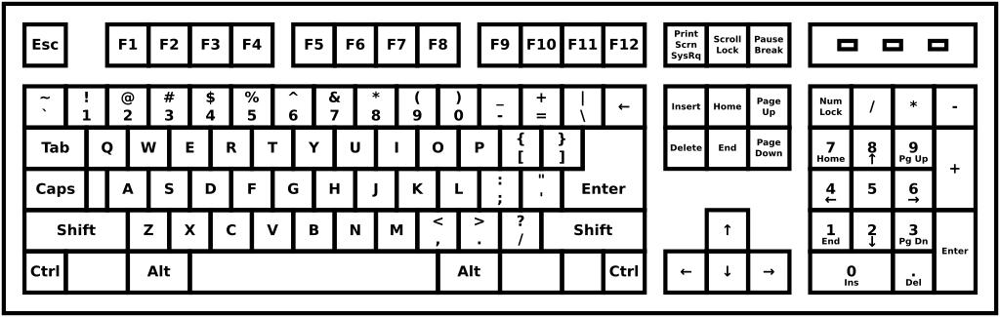

## Introduction

**Live coding** is all about ... coding on a keyboard. It is not the usual coding experience though. You need to be fast, reactive, and you need to type well and avoid mistakes. When live coding, especially on stage, you might want to avoid stagnation or typing errors. Actually, the code editor will feel like an instrument after a bit of practice. Danger is everywhere, especially at your fingertips. Typing fast and well when you live code is important, because it will help you to stay in the flow of the improvisation and it will prevent you from many of the dangers that you might encounter otherwise. Of course, nobody is perfect and errors are part of the show too.

The coding activity is also about manipulating source code, and involves a fair amount of copy/cut/paste like operations. You may also want to learn how to quickly jum from a word to another or how to switch efficiently between multiple text files. The code editor can do a lot of things for you: inserting snippets, completing your code, suggesting a statement, etc...

This page will give you a list of advices for typing better on the computer keyboard. The page will be broken into multiple sections, each one dealing with one aspect of text input or text manipulation.

## Typing: speed, accuracy and endurance 

### Speed and accuracy

* There are many websites that will allow you to train your speed and accuracy, generally on random sequences of words. [Monkeytype](https://monkeytype.com/) is a good lightweight one that do not require any subscription. 
  * These websites are really good if you want/need to learn an alternative keyboard layout.
  * Be aware of symbols. Add symbols if you can because coding is all about syntax and weird operators.
  * Go easy. Typing is not natural at all and you can hurt yourself if you practice too much or in a bad position.
  * Going fast for the sake of going fast is not really smart. You will be faster if you try to be accurate. Try not to make mistakes.

### Endurance

* You can train your endurance by typing something while you read it. It can be a book or anything. [Typelit](https://www.typelit.io/) will allow to copy litterature classics while training your endurance and accuracy.
  * Don't try to be fast, but try to be consistant. 
  * You might read faster than you type. The frustration will encourage you to go fast!

### International keyboards

* **QWERTY** is king in the programming world. Very often, programming languages are designed (often involuntarily) around this keyboard layout. Some international keyboard layouts are not very well suited for coding. Some countries adopted the **QWERTY** layout as a *de facto* standard. Good for them.
* Alternative keyboard layouts might exist for coders willing to keep their habits. These layouts are often designed for programmers with a logic disposition of symbols, diacritics and symbolic notation. I am currently typing this text using the **AZERTY-AFNOR** keyboard, which is pretty good for a french person.
* Learning a keyboard layout is fast and simple. Just train as much as you can everyday until you regain your normal speed. People are usually fast learners for everything muscle-memory related.

## Code editors

### Modeless to modal editor

#### What are they?

* By default, people are used to *modeless* text editors (like **Word**, **Notepad**, etc). Pressing a key will enter the corresponding symbol in the current line. This is enough for more than 90% of the uses cases, and people generally except to enter text this way on the keyboard. Most people code this way as well, using a clever combination of text input, various key-combos and mouse movement.
* *Modal* editors such as **Vim** are using a different system. There are different modes for the keyboard: **INSERT**, **VISUAL**, **NORMAL**, etc.. The **VISUAL** mode will remap the keyboard to make text navigation faster, **INSERT** will behave almost like the *modeless* text entry, **NORMAL** will map various commands under your fingers, etc.. *Modal* editors are notoriously hard to learn, but once you learn them, they become like a second nature to the point where it's hard to go back to normal text entry.
  * **Vim** or **Emacs** are extensible by nature. You can script your own functions or add plugins.
  * **Vim** or **Emacs** are keyboard-centric editors. You rarely leave the keyboard to do anything else. The keyboard becomes the central mode of input and dialogue with your computer.
  * *Modal* editors are common in the programming world, where text manipulation skills matter. They are very well suited for live coding.

#### Why?

* *Modal* editors can give you superpowers for editing text: easy code navigation, integration with your terminal, macros, extensibility. 
* Keyboard-centricity: do everything with the keyboard. Central interface. 
* *...insert your good reasons here...*

## Code completion

### When not to?

* It is important to develop a muscle memory even for the most basic things: creating patterns, writing using the `mini-notation` syntax, etc.. Writing **Tidal** patterns can become an almost automatic and non-conscious task. You can now focus on the musical side of things.
* Not using completion if you are used to it can be a challenge that will force you to write new things that you haven't explored yet.

### Automatic completion

* Audio sample suggestion: read your `Dirt-Samples` folder and suggest some of them that you are not exploring very often.
* Function suggestion

### Custom snippets

* You can use custom completions for dealing with *boilerplate* code: init lines, repetitive structure, list of custom parameters, prepared patterns, etc... **Fun idea**: store an extensive amount of drum and boolean patterns.
