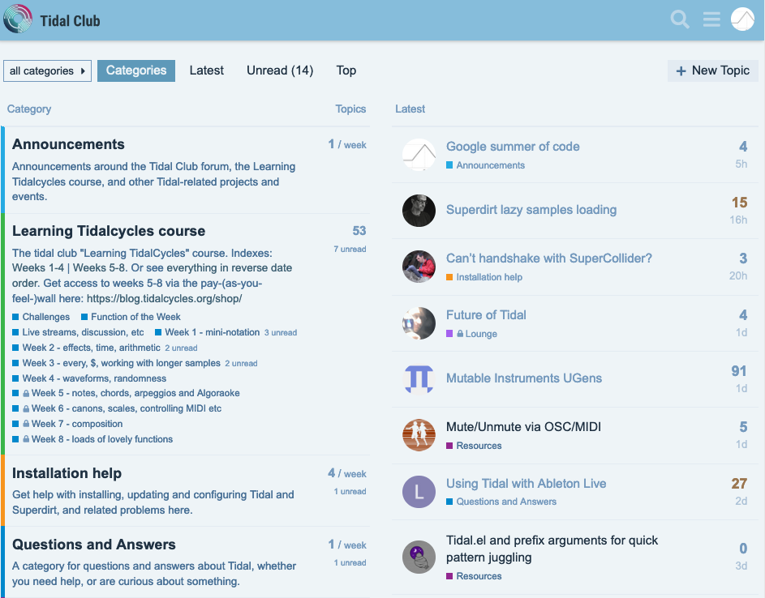

## Getting Help

The main place to get help is the [Tidal
Club](https://club.tidalcycles.org/) forum, for example the
[Installation help](https://club.tidalcycles.org/c/installation/5) and
[Questions and Answers](https://club.tidalcycles.org/c/q-and-a/9)
sections. You can [search the
forum](https://club.tidalcycles.org/search) to see if someone had the
same problem or question as you before, or post a new topic (requires [free signup](https://club.tidalcycles.org/signup)).

## Discussion and sharing

For live chat, you can find other TidalCyclists and live-coders on the following platforms:

[Discord](https://discord.com/invite/CqWhZEfNbq)             | [Rocket Chat](https://chat.toplap.org/channel/tidal) on the `#tidal` channel
:-----------------------------------------------------------:|:-------------------------:
                                             |  

:::caution

For troubleshooting, head for the Discord chat.

:::

## Development and reporting issues

If you wish to report an issue or to be involved in the development process:
- [Tidal Cycles](https://github.com/tidalcycles/tidal) repository on GitHub (language and pattern library).
- [SuperDirt](https://github.com/musikinformatik/SuperDirt) repository on GitHub (sound synthesis and SC).

For Tidal development and issue tracker, see the [tidal
repository]on github.

## Algorave and TOPLAP

If you like **Tidal Cycles**, you will love to learn that there are more people like you around the world! 

### TOPLAP

[TOPLAP](https://toplap.org/) for *Temporal Organisation for the Permanence of Live Artistic Programming* (let's pretend that it's not the reverse of laptop) is an art grouping exploring, sharing and creating using live coding tools. Founded in 2004, TOPLAP now exists around the world. There might be a local node in your city.
* [TOPLAP Forum](https://forum.toplap.org/)
* [TOPLAP Chat](https://chat.toplap.org/)

### Algorave

The [Algorave](https://algorave.com/) movement, born in 2011, is now organising Algoraves around the world. Check it out.

## Social media

* [Twitter](https://twitter.com/tidalcycles)
* [Youtube](https://youtube.com/tidalcycles)
