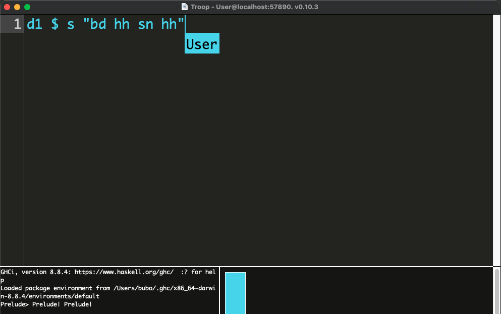
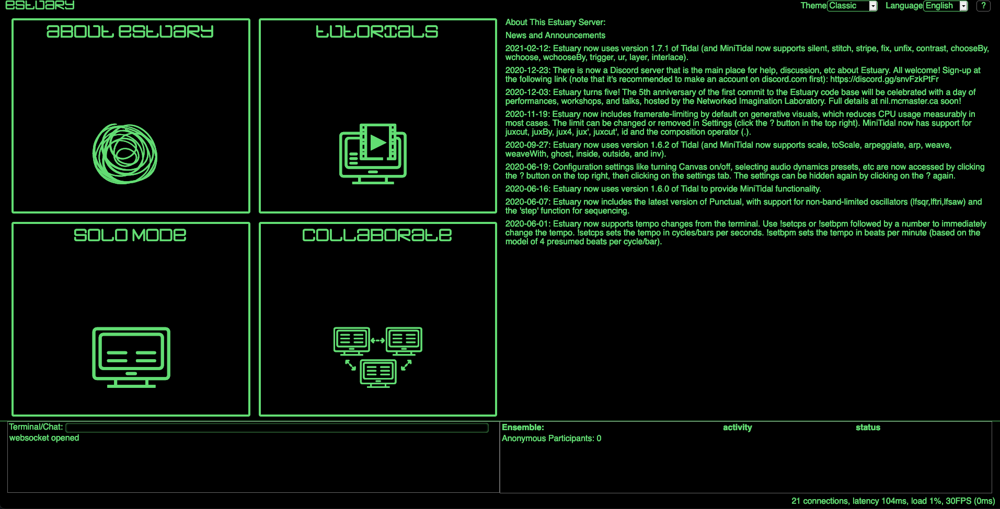

-----

There are different ways to use Tidal with your friends.

## Shared Editors

### Troop



[Troop](https://github.com/Qirky/Troop) is described by it author, Ryan Kirkbride (`Qirky`), as *"a real-time collaborative tool that enables group live coding within the same document across multiple computers."* Troop is a preconfigured text editor for collaborative live-coding on a network. Troop is written in [Python 3](https://www.python.org/). You will need to install Python and `tkinter` for your specific OS/distribution. Linux users might need to install a few more dependencies, but it should be straightforward.

:::caution
Note that you will also need to install **SuperCollider** and **Tidal Cycles** to use **Troop** on your computer. 
:::

For the installation / configuration process, please report to the README on the [GitHub repository](https://github.com/Qirky/Troop).


### Extramuros


[Extramuros](https://github.com/dktr0/extramuros), programmed by David Ogborn (`dktr0`), is an optimized collaborative environment for live coding. The text editor itself is embedded in a web browser. A server, receiving all the incoming code/data from the users, is connected to the interpreter. The editor can be divided in many zones, each one being an interpreter. Head to the [GitHub Repository](https://github.com/dktr0/extramuros) page to learn more about the installation / configuration process.


### Estuary



[Estuary](https://github.com/dktr0/estuary), also programmed by David Ogborn(`dktr0`) is a collaborative live coding environment with some components taken and extended from [Extramuros](###Extramuros). Estuary is embedding `minitidal`, a subset of Tidal Cycles that works directly (including sound!) in your web browser. No installation is required.

[Chrome](https://www.google.com/chrome/) or [Chromium](https://www.chromium.org/) is **highly recommended** for a better user experience.

#### Estuary online

There is a [server](https://estuary.mcmaster.ca) running 24/7 on the McMaster University servers, on a server belonging to the research group behind the project. It means that you can try **Tidal Cycles** online with your friends without having to install anything!

## Network tempo sharing

Network tempo sharing is one way of synchronizing Tidal to other instances running on different computers. This approach is more complex and "hands-on" than the ones described above. They might be better suited to more advanced / technically skilled users. 

Note: This method does not work as of Tidal 1.9. Consider using [Native Link Protocol Synchronization](#native-link-protocol-synchronization) instead.

### 1) Sync computer clocks

Ensure that the system clocks of all the computers are already in sync. This can be done by making sure the computers are *syncing with a network clock via system settings*, but this isn't ideal. Under the hood that uses `ntpd`, which is designed for slowly bringing computers into synchrony over the internet, not for quickly getting computers in sync locally. 

Instead, using [ptpd](https://github.com/ptpd/ptpd) is recommended. 

:::caution
[ptpd](https://github.com/ptpd/ptpd) is available for Linux and MacOS only.
:::

### 2) Start Tidal on your computer

Nominate **one** computer as the `clock server` and start Tidal there. You will need to know the network address of this computer on the local network. You should be able to find this in your system settings. 

### 3) Sync the other computers to the clock server

Change your Tidal Boot configuration on the other computers to set the `cTempoAddr` option to the IP address of the clock server. For example, if the clock server had the IP address `'192.168.0.10'`, your `startTidal` line would look something like this: 

```haskell
tidal <- startTidal (superdirtTarget {oLatency = 0.02}) (defaultConfig {cFrameTimespan = 1/20, cTempoAddr = "192.168.0.10"})
```

### 4) Setting CPS

Use `setcps` on one of the computers to get all the computers in sync (g.g. `setcps 1.1`). 

### 5) adjust latency

You will probably find that your computers are still 'out of phase': running at the same cps, but with an offset. Set the cps low (e.g. `setcps 0.25`), run a simple pattern on the clock server (`d1 $ s "cp"`) and one of the other computers, and use nudge to find the offset (`d1 $ s "cp" # nudge 0.05`).

Once you know the right offset you can make it permanent by adding it to the `oLatency` value in your configuration. As long as you use the same audio device and so on, you shouldn't have to adjust it again.

If you find you have to nudge backwards (e.g. `d1 $ s "cp" # nudge (-0.05)`) this will only work up to a certain point. It's better to add latency to the clock server in that case. 

## Link Protocol Synchronization

[Link](https://www.ableton.com/en/link/) is a protocol for
synchronizing musical gear, software or hardware. Link will
synchronize all the devices found on a local network together. Timing
and tempo will be shared by all clients. It was originally created by
a music software company called Ableton, but they shared it with the
open source community and it doesn't require any of their software to
use.

## Native Link Protocol Synchronization

Tidal version 1.9 directly integrates with Ableton Link.  Link
Synchronization is enabled by default and Tidal will automatically
connect with other link-compatible applications on the same local
network, including other Tidal instances.

### Adjusting Quantum and Cycles per Beat

In addition to aligning beats, Link aligns bars / loop boundaries. Quoting [Link documentation](http://ableton.github.io/link/) on Phase Synchronization: "In order to enable the desired bar and loop alignment, an application provides a quantum value to Link that specifies, in beats, the desired unit of phase synchronization. Link guarantees that session participants with the same quantum value will be phase aligned, meaning that if two participants have a 4 beat quantum, beat 3 on one participant’s timeline could correspond to beat 11 on another’s, but not beat 12."

Quantum can be set in the Tidal Boot configuration, using the option `cQuantum`. The default value of `cQuantum` is `4`.

In addition to quantum, Tidal lets you configure the number of beats there should be per cycle. This is done using the option `cBeatsPerCycle`. The default value is `4`. In this case, a BPM (beats per minute) of `120` corresponds to a CPS (cycles per second) of `120 / 60 / 4`. See the [Getting Started Tutorial](../getting-started/Tutorial.md) for more information on converting between BPM and CPS.

It's possible to use any combination of `cQuantum` and `cBeatsPerCycle` but some combinations might produce unintuitive results.
We advice you to start with `cQuantum = cBeatsPerCycle`, but please share findings from your experiments!

Example:

```haskell
tidal <- startTidal superdirtTarget (defaultConfig {cQuantum = 3, cBeatsPerCycle = 3})
```

### Adjusting latency

You might find that even though tempo is synchronized, events don't quite line up. This happens because Ableton Link is not aware of the latencies of different devices or software.

Link uses the concept of a shared timeline where a timestamp corresponds to when the sound should hit the speakers. But it does not know how far ahead a sound should be produced to hit the speakers at the right time. Different devices or software will have different latency and we thus need to adjust for that. The document [How to adjust sync when using Link](https://help.ableton.com/hc/en-us/articles/360003280139-How-to-adjust-sync-when-using-Link) says "Sometimes playback might be slightly offset, this is usually due to different playback latency of devices."

#### How to adjust latency

The first step of adjusting latency is to find how much to adjust it.
Set the cps low, e.g.
```
setcps 0.25
```

Run a simple pattern, e.g.
```
d1 $ s "cp"
```

Use [nudge](../patternlib/howtos/startpattern.md#nudge) to
find the offset
```
d1 $ s "cp" # nudge 0.05
```

Once you know the right offset you can make it permanent by subtracting it from
the [oLatency value in your configuration](./boottidal.md#controlling-latency). As
long as you use the same audio device and so on, you shouldn't have to
adjust it again. We need to use subtraction because nudge moves events later in time whereas oLatency moves events earlier in time.

You might have to nudge backwards, e.g.
```
d1 $ s "cp" # nudge (-0.05)
```

This is equivalent to increasing oLatency. When nudging backwards a lot, or when olatency is very high, Tidal might start processing the event too late. This can be avoided by adjusting [cProcessAhead in your configuration](./boottidal.md#controlling-latency)

### Disabling Link synchronization

Tidal can be configured to not synchronize with other Link session.

Change your Tidal Boot configuration to set the `cEnableLink` option to False. As an example, your `startTidal` line would look something like this: 

```haskell
tidal <- startTidal superdirtTarget (defaultConfig {cEnableLink = False})
```

### Tidal instances don't automatically have the same cycle

Link does not align beat/cycle values between session participants. Quoting [Link documentation](http://ableton.github.io/link/) "For example, beat 1 on one participant’s timeline might correspond to beat 3 or beat 4 on another’s, but it cannot correspond to beat 3.5". If aligned cycles is desired, use `resetcycles` in each Tidal instance simultaneously.

See [Automatic alignment of cycles in Link sessions - issue #936](https://codeberg.org/uzu/tidal/issues/936) for further discussion.

## Link Protocol Synchronization using Carabiner

Tidal version 1.0.11 and 1.8 supports a rudimentary integration with Link, using [Carabiner](https://github.com/Deep-Symmetry/carabiner).

To synchronise with the Link protocol, follow the following steps:

1. Download and run Carabiner, which acts as a bridge between the Link protocol and software like Tidal.
If you are on a Mac OS X, Windows x64, Linux x64, or Raspberry Pi system, you can download the executable from the Carabiner [releases](https://github.com/brunchboy/carabiner/releases) page. Other users can find instructions for compiling [here](https://github.com/Deep-Symmetry/carabiner#building).
2. Have another link-compatible application to hand that you want to sync to. 
3. Start Tidal in your editor, and run the following to connect to carabiner:

```haskell
sock <- carabiner tidal 4 (-0.14)
```

4. Run a Tidal pattern (e.g. `d1 $ (sound "cp bd bd bd")`), change the BPM in another link-compatible application and see if it works.

:::tip
To change the BPM from tidal, you currently have to run e.g. `sendMsg sock "bpm 155"`
:::

## ESPGrid tempo sharing

EspGrid is a language-neutral, separate piece of open source software for sharing tempo and other things in electronic ensembles. The software is available on [dktr0's website](https://dktr0.github.io/EspGrid/install.html). It is made so that changing the tempo on one instance will change the tempo on all the instances. Every change is reflected everywhere.

Note: The ESPGrid integration was removed in Tidal 1.9 when Tidal started using Link for scheduling events.

### 1) Start EspGrid/espgridd

Detailled instructions for installing, starting and configuring EspGrid/espgridd are available at the link mentionned above.

### 2) Start Tidal and SuperDirt 

Start Tidal the usual way. 

### 3) Sync with EspGrid

Just evaluate `espgrid tidal` in your editor session.

### 4) Change the tempo

You can change the tempo for everyone synced to EspGrid with `cpsEsp 0.5`, `cpsEsp 0.75`, etc. If others change the tempo (including via the OSX GUI **EspGrid** app, SuperCollider quarks, etc) your tempo should change as well. 

### CPS and BPM

You can't adjust `cps` in Tidal and have that change BPM in the link network yet - this will be fixed up soon. You can tweak the startup command:

```haskell
sock <- carabiner tidal 4 (-0.14)
```


You can't adjust cps in Tidal and have that change bpm in the link network yet - this will be fixed up soon.

### Understanding the Link command

Let's get a closer look at this cryptic line of code:

```haskell
sock <- carabiner tidal 4 (-0.14)
```

* `4`: the number of beats per cycle. Used to convert between link's beat-per-minute and Tidal's cycles-per-second. You might prefer 2 (or 3 if you're doing a waltz).
* `-0.14`: latency time adjustment to get Tidal in phase. You might need to tweak it, to get it bang on.

:::caution
You have to restart Tidal everytime you adjust these numbers. You can do that by restarting your text editor. This will be more easily configured in the future. 
:::

Report your good or bad experiences [here]( https://toplap.lurk.org/t/link-support-preview/418).
