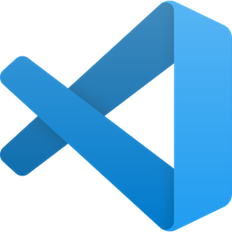

-----

VSCode is a general purpose text/code editor published by Microsoft, with some open-source components. Tidal Cycles code can be written in the **VS Code** editor through an extension. VSCode is currently the most popular code editor on the market based on some metrics. It is highly configurable, and can run on every major OS. There are also thousands of plugins to support new programming languages, frameworks, edition modes, etc...

## Install VSCode

Installing VSCode on your computer should be straigthforward. Head to the [official website](https://code.visualstudio.com/) and download the version corresponding to your operating system. Done. 

## Tidal Cycles Extension

There is [Tidal Cycles Extension](https://marketplace.visualstudio.com/items?itemName=tidalcycles.vscode-tidalcycles) for **VSCode**. You can also check out the main [repository](https://github.com/kindohm/vscode-tidalcycles) if you want to report an issue or contribute to the development of this extension.

The installation process is simple:

1) open VSCode, click on the `Extensions` panel on the left side.

2) search for `tidal` and click `install`.

### Special features

The VSCode Tidal Cycles extension features something that is not present in other text editor extensions: an audio file browser. Click on the Tidal Cycles logo that appeared on the left pane right after the install to see all the samples currently available for Tidal and preview/insert them directly in your code.

### Configuration

Be sure to check out the plugin `README` and configuration pane to learn more about customization/configuration.

