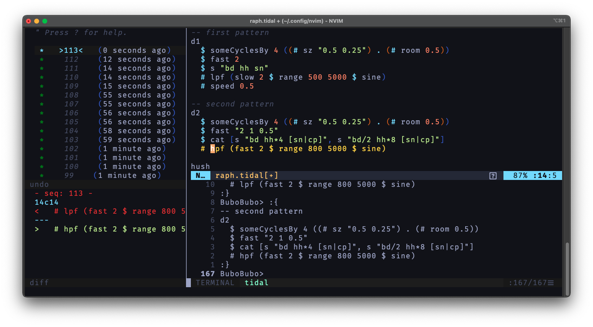

----


[Vim](https://www.vim.org) is the [classic and ubiquitous](https://en.wikipedia.org/wiki/Vim_(text_editor)) text editor. This editor is famous for its minimalistic approach, flexibility, and for its unique approach to [modal editing](https://en.wikipedia.org/wiki/Vi#Interface). Vim and [Neovim](https://neovim.io/) are free, cross-platform and open-source. They can be extended through the help of plugins, and are generally more configurable than other text editors. Vim has a very long history and has the reputation of being very stable and fast.

Vim is generally used by experienced users: developers, system administrators, tech enthusiasts. It has a steep learning curve, but fluency allows the user, after a while, to edit text at the speed of light and with great precision.

-----

## Vim-Tidal


[Vim-Tidal](https://github.com/tidalcycles/vim-tidal) is the recommanded plugin to interact with Tidal Cycles. It will work for both [Vim](https://www.vim.org/) and [Neovim](https://neovim.io/), and will adapt to your setup. You can use Neovim's native `terminal` functionality, as well as `tmux` or other multiplexers. Check the [README](https://github.com/tidalcycles/vim-tidal#readme) file for more information about the installation process.

----

## Vim: Tips and tricks

### Undotree



As suggested by `@guiot` on the [Tidal Club](https://club.tidalcycles.org) Forum. You can keep track of your improvisations using the [undotree](https://github.com/mbbill/undotree) plugin for Vim/Neovim. Using the undotree wisely is a great way to backtrack in time or to keep a `plaintext` trace of your improvisations. By default, `undotree` will record every little tiny changes in your text file. Activate the `undotree` for a file by entering the `:UndotreeToggle` command.

### Hacky custom completion

You can create custom code completions by placing the following lines in your `.vimrc` file. This function will working only if a `.tidal` file is currently being edited with `vim-tidal`:

```c
autocmd FileType tidal call s:tidal_abbr()
function! s:tidal_abbr()
    inoreabbr billybd "[t ~ ~ ~] [~ ~ ~ ~] [t ~ ~ ~] [~ ~ ~ ~]"
    inoreabbr billysn "[~ ~ ~ ~] [t ~ ~ ~] [~ ~ ~ ~] [t ~ ~ ~]"
    inoreabbr billych "[t ~ t ~] [t ~ t ~] [t ~ t ~] [t ~ t ~]"
    inoreabbr bluemondaybd "[t ~ ~ ~] [~ ~ ~ ~] [t ~ ~ ~] [~ ~ ~ ~]"
    inoreabbr bluemondaysn "[~ ~ ~ ~] [t ~ ~ ~] [~ ~ ~ ~] [t ~ ~ ~]"
    inoreabbr bluemondaycp "[~ ~ ~ ~] [t ~ ~ ~] [~ ~ ~ ~] [t ~ ~ ~]"
    inoreabbr bluemondayoh "[~ ~ t ~] [~ ~ t ~] [~ ~ t ~] [~ ~ t ~]"
    ... etc ...
endfunction
```

Simply write `billybd` or `billysn` to see the text being replaced by your pattern. Try to give these snippets very distinctive names so that they don't enter in conflict with language or library keywords.
