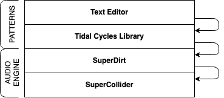

----

Tidal Cycles is not a big monolithic software. It is better to think about it as an interconnexion between several components: 

1. A Pattern Library
   * (1) Your **text editor**
   * (2) The **interpreter** (Haskell) 
2. An audio engine
   * (1) **SuperDirt** for receiving messages and turning them to sound.
   * (2) **SuperCollider**, sending sound out.



-----

## Launching Tidal 

There will always be two steps to launch Tidal:
1. Start **SuperCollider** and then **SuperDirt** inside of it.
2. Start **Tidal Cycles** from your text editor.

This page will explain you how to do so. It will also teach you to automate these tasks so you won't have to repeat the setup part again and again :smile:.

### Start SuperCollider and SuperDirt 

#### From the IDE

The most minimalistic command you could use to start **SuperDirt** is the following one:
```c
SuperDirt.start;
```

However, this command will start the engine using the **SuperCollider** default *server options*. It might not be the best solution. Depending on your needs, you might want to adapt to a specific audio configuration. You might also want to load more (or less) samples and finetune the memory or the latency of the audio server. 

For a more *fine-tuned* startup configuration, take a look [at this script](https://raw.githubusercontent.com/musikinformatik/SuperDirt/develop/superdirt_startup.scd) (also visible below).

Evaluate the script or the line by selecting the text in the editor and pressing Ctrl/Cmd+Enter. You should see the following line in the logs after a few seconds:
```c
SuperDirt: listening to Tidal on port 57120
```

You can now launch Tidal Cycles from your text editor and make music.

##### Boot SuperDirt everytime SuperCollider starts 

Open SuperCollider. Click on `File > Open startup file`. Paste the following text-file in the new buffer that just appeared:
```c
/*
This is an example startup file. You can load it from your startup file
(to be found in Platform.userAppSupportDir +/+ "startup.scd")
*/

(
s.reboot { // server options are only updated on reboot
	// configure the sound server: here you could add hardware specific options
	// see http://doc.sccode.org/Classes/ServerOptions.html
	s.options.numBuffers = 1024 * 256; // increase this if you need to load more samples
	s.options.memSize = 8192 * 32; // increase this if you get "alloc failed" messages
	s.options.numWireBufs = 64; // increase this if you get "exceeded number of interconnect buffers" messages 
	s.options.maxNodes = 1024 * 32; // increase this if you are getting drop outs and the message "too many nodes"
	s.options.numOutputBusChannels = 2; // set this to your hardware output channel size, if necessary
	s.options.numInputBusChannels = 2; // set this to your hardware output channel size, if necessary
	// boot the server and start SuperDirt
	s.waitForBoot {
		~dirt = SuperDirt(2, s); // two output channels, increase if you want to pan across more channels
		~dirt.loadSoundFiles;   // load samples (path containing a wildcard can be passed in)
		// for example: ~dirt.loadSoundFiles("/Users/myUserName/Dirt/samples/*");
		// s.sync; // optionally: wait for samples to be read
		~dirt.start(57120, 0 ! 12);   // start listening on port 57120, create two busses each sending audio to channel 0

		// optional, needed for convenient access from sclang:
		(
			~d1 = ~dirt.orbits[0]; ~d2 = ~dirt.orbits[1]; ~d3 = ~dirt.orbits[2];
			~d4 = ~dirt.orbits[3]; ~d5 = ~dirt.orbits[4]; ~d6 = ~dirt.orbits[5];
			~d7 = ~dirt.orbits[6]; ~d8 = ~dirt.orbits[7]; ~d9 = ~dirt.orbits[8];
			~d10 = ~dirt.orbits[9]; ~d11 = ~dirt.orbits[10]; ~d12 = ~dirt.orbits[11];
		);
	};

	s.latency = 0.3; // increase this if you get "late" messages
};
);
```

Save the file, and *voilà*! SuperCollider will always boot **SuperDirt** as soon as the program is launched. As you can see, this script is also showing you how to load custom audio samples, and how to deal with multichannel sound.

:::caution
You will find an up-to-date version of the script [here](https://raw.githubusercontent.com/musikinformatik/SuperDirt/develop/superdirt_startup.scd).
:::

#### From the command line (for experienced users)

Alternatively, you can start `sclang` from the terminal to get an interactive prompt without having to launch the **SuperCollider** IDE. 

-----

### Start Tidal Cycles

We will assume that you are working with the [Atom](https://atom.io) editor for now. For specific instructions concerning the text editor of your choice, take a look at the `Get a Text Editor` submenu in the sidebar that will contain more detailled instruction.

1.  Start Atom
2.  Create a new file and save it with a filename that ends in `.tidal`,
    (e.g. `test.tidal`).
3.  open the Packages menu and select `TidalCycles -> Boot
    Tidal Cycles`. A small window will open at the bottom of the window
    containing the `t>` prompt (and *hopefully* no error messages).

Let's try it! Type the following pattern in the text editor and press `Shift+Enter` to evaluate it (`Ctrl+Enter` will evaluate multiple lines):

```haskell
d1 $ sound "bd sn"
```

If you hear sound, congratulations :thumbsup: ! If you get stuck, you are welcome to ask questions and share problems on the forum, the [RocketChat](https://chat.toplap.org/channel/tidal) or the [Discord](https://discord.com/invite/CqWhZEfNbq) group. Something must be misconfigured or missing from your Tidal system!


As is common with free software, you have alternative choices for the
different components that make up a Tidal Cycles system. **Atom** and
**SuperDirt** might be all you ever need, but there are other editors and
synths you can use. Take a look at the sidebar to see the alternatives.
