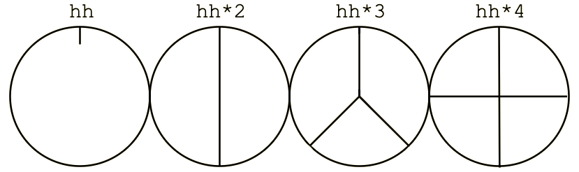

**Tidal Cycles** is not using **BPM** (*beats per minute*) but a specific measurement called **CPS**: *cycles per second*. For Tidal, time is *cyclical* and not *linear*. It means that when a cycle ends, a new one will follow. Time is counted in smaller and smaller decrements of *cycles per second* (e.g. 1/3 of a cycle). 



This rather original way of dealing with time can be quite surprising for a musician, because both traditional european notation and modern sequencers are generally linear and deal with the beginning of time and the ending of time. Tidal can **backtrack** or **fastforward** in time because you can actually predict what will happen in `x` cycles or what happened `x` cycles ago (well, kinda..).

## Dividing the cycle 

Don't focus on the syntax so far! Enter the following pattern in your text editor and evaluate it:

```c
d1 $ s "bd hh bd hh"
```

You just divided a cycle in four equal parts, one for each of the sounds you just triggered. However:

```c
d1 $ s "bd hh hh"
```

Now, the cycle is being divided in three equal parts, you might have noticed that it slowed down a little. 

You can superpose patterns that will divide the `cycle` in different subdivisions. It means that Tidal is a rather good tool to explore polyrhythmy and rhythmic intricacies: 

```c
d1 $ s "bd hh hh"

d2 $ s "hh:2 ~ hh:3 cp"
```

## Visualizing cycles


**Tidal** can help you to visualize the output of a given pattern textually or graphically. [tidal-vis](https://github.com/tidalcycles/tidal-vis) can go even further by turning textual patterns into their visual counterpart. Enter the following pattern: 

```c
"1 2 3"
```

You should see this result in the logs (the `ghci` window): 
```c
(0>⅓)|"1"
(⅓>⅔)|"2"
(⅔>1)|"3"
```

You can also use the `drawLine` function to visualize the output of a pattern in the log console. 

```c
drawLine "a b*2 d"
```

You might get something that looks like this:
```c
[11 cycles]
|a-bbd-|a-bbd-|a-bbd-|a-bbd-|a-bbd-|a-bbd-|a-bbd-|a-bbd-|a-bbd-|a-bbd-|a-bbd-
```

## Convert between BPM and CPS

Sometimes, you will need to convert between BPMs and CPS (e.g. synchronization with another musician or machine). The `setcps` function is used to change the number of *cycles per second*. The default number of cycles per second is 0.5625. 

These two values are equivalent:
* `setcps 0.5625`: Cycles per second, as a decimal.
* `setcps (135/60/4)`: Cycles per second, as a fraction.

Representing cycles per second using fractions has the advantage of being more human-readable and more closely aligned with how tempo is commonly represented in music as beats per minute (or bpm). Techno has a range of 120-140 bpm. House has a range of 115-130 bpm. And so on. If we wanted to set the tempo of our Tidal song to fast house, we would do the following: 

```c
-- Set cps to be a fast house beat
setcps (130/60/4)
```

Regarding the example above, the first part of the fraction `130/60`, says there will be 130 beats per minute. 130 is the number of beats and 60 is the length of the minute (60 seconds). The second part of the fraction `/4` says that for every cycle in tidal there will be 4 beats. You can adjust this value to change how quickly your cycles run. 

## Pop-up window

You can use **SuperCollider** GUI libraries to create a small window showing the current state of the **Tidal** Clock. `pulu` scripted the following solution:
```c
// start superdirt first
(
var clockMods, clockBeats, screenW, screenH, clockW, clockH, clockX, clockY, resizable, border;
clockMods = [4,6];
clockBeats = 4;
screenW = 1440;
screenH = 900;
clockW = 120;
clockH = 22;
clockX = screenW - clockW;
clockY = screenH - 1;
resizable = false;
border = false;

~clockText = StaticText()
.string_("[clock]")
.font_(Font.defaultMonoFace)
.align_(\center)
.stringColor_(Color(1,1,1))
.minHeight_(20);

~updateClock = { |cycle|
    var text, beat;
    text = clockMods.collect { |m| "" ++ (cycle.floor.asInteger.mod(m) + 1) ++ "/" ++ m; }.join(" ");
    beat = (cycle.mod(1)*clockBeats).round.asInteger + 1;
    text = text ++ " " ++ clockBeats.collect { |i| if(i < beat, ".", " "); }.join;
    ~clockText.string_(text);
};

~clockWindow = Window("clock", Rect(clockX, clockY, clockW, clockH), resizable, border)
.background_(Color(0.3,0.3,0.3))
.layout_(
    HLayout(
        ~clockText
    ).margins_(0!4)
);

~clockWindow.alwaysOnTop_(true);
~clockWindow.visible_(true);

SynthDef(\tick, { |cycle|
    SendReply.kr(Impulse.kr(0), "/tick", [cycle]);
    FreeSelf.kr(Impulse.kr(0));
}).add;

OSCdef(\tick, { |msg|
    var cycle;
    #cycle = msg[3..];
    Routine {
        { ~updateClock.(cycle); }.defer;
    }.play(SystemClock);
}, "/tick");
)
```

After evaluating this script (in your `BootTidal.hs` or after booting **SuperDirt**), play the following pattern:
```haskell
p "tick" $ "0*4" # s "tick"
```
