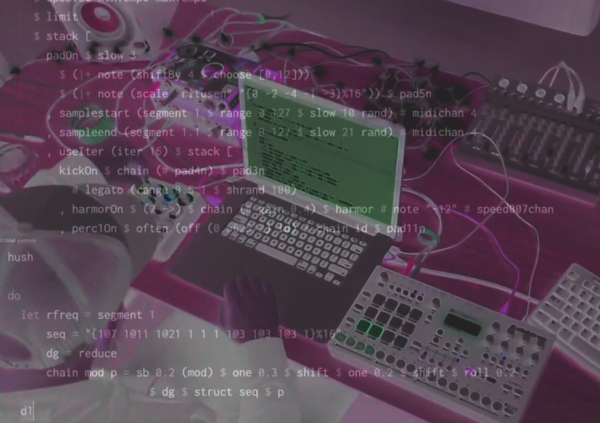

The **TidalCyclists** have been busy! Here are some of the releases, videos, performances that people have made with **Tidal**. You will also find a list of artists working with **Tidal**.

## YouTube
### YouTube Playlists
* [Performances](https://www.youtube.com/playlist?list=PLybSFICi4UliK17U6rxPneXAyxvmGAe5T)
* [Experiments](https://www.youtube.com/playlist?list=PLybSFICi4UlgoIOK5A2LxCs6lUwyUJZwQ)
* [Tutorials](https://www.youtube.com/playlist?list=PLybSFICi4UlgKU6ZVerY0HfdNCl3AIoPU)
* [Alex McLean Tutorials](https://www.youtube.com/watch?v=M-Y5pAEBXXQ&list=PL2lW1zNIIwj3bDkh-Y3LUGDuRcoUigoDs)
* [Michael Bratt Tutorials](https://www.youtube.com/watch?v=0TtxZQUOGGw&list=PLlWmK4qVXO37vgyLeNe8ElF15pInARU6x)

### YouTube Channels

* [Eulerroom](https://www.youtube.com/channel/UC_N48pxd05dX53_8vov8zqA)
* [Eris Fairbanks](https://www.youtube.com/c/ErisFairbanks/videos)
* [Kindohm](https://www.youtube.com/c/kindohm/videos)
* [Lil Data](https://www.youtube.com/c/LilData/featured)
* [David Ogborn](https://www.youtube.com/user/ogbornd/videos)
* [Bernard Gray](https://www.youtube.com/c/BernardGray1/videos)

### Documentaries on YouTube

* [TEDxHull](https://www.youtube.com/watch?v=nAGjTYa95HM)
* [Algorave Generation | Resident Advisor](https://www.youtube.com/watch?v=S2EZqikCIfY)
* [bluedot 2018](https://www.youtube.com/watch?v=496NVIHprOg)
* [NL_CL#3](https://www.youtube.com/watch?v=Uo-2oxI6aqU)
* [The Guardian](https://www.youtube.com/watch?v=h340aNznHnM)
* [VICE](https://www.youtube.com/watch?v=RbxLoh3FNrY)
* [Karachi Community Radio](https://www.youtube.com/watch?v=ziD5diimFHM)
* [Music Hackspace](https://www.youtube.com/watch?v=5a_yjPYw3oM)
* [Sounds of Code - The Creative Power of Live Coding](https://www.youtube.com/watch?v=uA4SDytz8Aw)
* [Tracks](https://www.youtube.com/watch?v=X_NQKPH91kM)
* [Le Monde](https://www.lemonde.fr/pixels/article/2019/04/13/aux-algoraves-on-danse-sur-une-musique-codee-en-direct_5449894_4408996.html)
* [GitHub Universe](https://www.youtube.com/watch?v=nmjmmDvLkT0)

## Tidal artists

Some **TidalCyclists**:

* [Alexandra Cardenas](http://cargocollective.com/tiemposdelruido/Alexandra-Cardenas)  (Berlin, DE)
* [Anny](http://anny.audio/) (London, UK)
* [bgold](http://bgold-cosmos.github.io/) (S St Paul, MN)
* [Blaerg](http://immigrantbreastnest.com/album/redundant-tautologies) (New York, US)
* [c0d3 p03try](https://c0d3-p03try.neocities.org/) flor de fuego + rapo (La Plata, AR)
* [Calum Gunn](http://www.calumgunn.com/) (Berlin, DE)
* [CLiC](https://colectivo-de-livecoders.gitlab.io/) - Colectivo de Live Coders (La Plata, AR)
* [CNDSD](https://vimeo.com/cndsd) (Mexico City, MX)
* [Control problem](https://soundcloud.com/controlproblem) (Sheffield, UK)
* [Cybernetic Orchestra](http://esp.mcmaster.ca/?page_id=502) lead by [David Ogborn](http://www.d0kt0r0.net/) (Hamilton, CA)
* [Digital Selves](https://www.youtube.com/watch?v=t2KeNblKSFM) (London UK)
* [DuoF](https://duo-f.github.io/) fer + rapo (La Plata, AR)
* [Heavy Lifting](https://heavy-lifting.github.io/) (Sheffield, UK)
* [Khoparzi](https://khoparzi.com/) (Allahabad / Bombay, India)
* [Kindohm](http://kindohm.com/) (Minneapolis, US)
* [Lil Data](http://data.pcmusic.info/) (Internet)
* [Lysuc](http://lysuc888.blogspot.co.uk/) (Northern Argentina, AR)
* [Mancvso](https://soundcloud.com/mancvso/) (Chile)
* [Miri Kat](https://mirikat.bandcamp.com/) (London, UK)
* [MrReason](https://mrreason.org/) (Leipzig, DE)
* [munshkr + x/q](http://ikag.github.io/) (Buenos Aires, AR)
* [Nullish](http://nullish.org/) (Sheffield, UK)
* [Polinski](http://www.paulwolinski.co.uk/) (Manchester, UK)
* [Rachel Devorah](https://racheldevorah.studio/) (Boston, US)
* [Spednar](https://soundcloud.com/spednar) (Pittsburgh, US)
* [u-mano u-dito](https://umanoudito.bandcamp.com) (Trento, IT)
* [voodoochild](http://voodoochild.bandcamp.com/) (Valdivia, Chile)
* [Yaxu](http://slab.org/) + also in [CCAI](http://ccai.lurk.org/), [Canute](http://canute.lurk.org/) and [Slub](http://slub.org/) etc (Sheffield, UK)
* [yecto](https://yecto.github.io/) (Montréal / Mexico)

## Press

* Peter Kirn, [Inside the livecoding algorave movement, and what it says about music](http://cdm.link/2018/05/inside-the-livecoding-algorave-movement-and-what-it-says-about-music/), CDM, May 2018
* Darwin Grosse, [Art+Music+Technology](http://artmusictech.libsyn.com/podcast-210-alex-mclean) podcast, December 2017
* Jack Chuter, [ATTN:Magazine show #7](http://www.attnmagazine.co.uk/features/12173), Resonance Extra, July 2017
* Dean Honer, [The Golden Age of the Future](https://slab.org/the-golden-age-of-the-future/), Electronic Sound magazine, Issue 31, 2017
* Mary Anne Hobbs, [3 minute epiphany: how to create an algorave](http://www.bbc.co.uk/programmes/p055hl4w), Radio 6 music, June 2017
* DJ Semtex, [Are Algorithms In Tune with Music?](https://nationofbillions.com/are-algorithms-in-tune-with-music), Nation of billions, March 2017
* Steph Kretowicz, [Algorave: The live coding movement that makes next-level electronic music](http://mixmag.net/feature/algorave), Mixmag, Jan 2017
* Alan Raw, [BBC Introducing](http://slab.org/bbc-introducing-west-yorkshire/), BBC Radio Leeds, June 2016
* Emma Sugarman, [New Voices](http://read.thesampler.org/2016/05/06/meet-the-new-voices-2016-alex-mclean-talks-coding-and-aliases/), Sound and Music, May 2016
* Emily Bick, [Pattern Recognition](http://slab.org/interview-in-the-wire-magazine/), The Wire, March 2016
* Daniel Temkin, [Estoteric codes](http://esoteric.codes/post/135188341128/interview-with-alex-mclean), December 2015
* Dr Sarah Bell, [Live coding brings programming to life](http://www.britishscienceassociation.org/blog/live-coding-brings-programming-to-life-an-interview-with-alex-mac), British Science Association blog, September 2015
* Live coding and algorave, a composer-curator guest post on the Sound and Music sampler blog, February 2015
* Paul Squires, [In conversation with… Kate Sicchio and Alex McLean](http://www.imperica.com/en/in-conversation-with/in-conversation-with-kate-sicchio-and-alex-mclean), Imperica, March 2014
* Robert Barry, [I For One Welcome Our New Robot Vocal Cords: Radical Computer Music](http://thequietus.com/articles/14405-black-midi-algorave), The Quietus, February 2014
* Tracks, [Live Coding and Algorave feature](http://www.youtube.com/watch?v=X_NQKPH91kM), Arte TV (France and Germany), January 2014
* Clemens Lambermont, [Algorave interview](http://www.youtube.com/watch?v=xh8b-XH2kqM&list=UU-id0vwQoAUYBNCm0nmaqQw), NOS.nl, November 2013
* Joe Muggs, [Algoraving: dancing to live coding](http://www.redbullmusicacademy.com/magazine/algoraving-dancing-to-coding), Red Bull Music Academy, October 2013
* Jamillah Knowles, [Outriders](http://www.bbc.co.uk/programmes/p02swmfb), BBC Radio 5 Live, September 2013
* Tom Cheshire, [Hacking meets clubbing with the ‘algorave’](http://www.wired.co.uk/magazine/archive/2013/09/play/algorave), Wired UK (print and online), August 2013
* Stephen Fortune, [What on earth is live coding?](http://www.dazeddigital.com/artsandculture/article/16150/1/what-on-earth-is-livecoding), Dazed and Confused magazine, May 2013
* Vincent Welleman, [SLUB-trio: Muziek moet het visuele volgen, niet omgekeerd](http://www.kwadratuur.be/interviews/detail/slub-trio/#.UxgrAjxdX1c), Kwadratuur, May 2010
* Tom Armitage, [Slub: Making music with live computer code](http://www.wired.co.uk/news/archive/2009-09/25/making-music-with-live-computer-code-), September 2009
* Jason Palmer, [Tech Know: Programming, meet music](http://news.bbc.co.uk/1/hi/technology/8221235.stm), BBC News website, August 2009
* Alessandro Ludovico, [Live coding: I think in Text](http://yaxu.org/neural-interview-on-live-codin/), Neural Magazine, June 2007

### Tidal blog interviews
* [Malitzin Cortes](http://blog.tidalcycles.org/cndsd/) a.k.a. CNDSD
* [Mike Hodnick](http://blog.tidalcycles.org/kindohm-interview/) a.k.a. Kindohm

## Academic Publications

All of these are open access publications:

* N. Del Angel, Luis, Teixido, Marianne, Ocelotl, Emilio, Cotrina, Ivanka, & Ogborn, David. (2019). [Bellacode: localized textual interfaces for live coding music](http://iclc.livecodenetwork.org/2019/papers/paper111.pdf). In Proceedings of the International Conference on Live Coding, Madrid, Spain.
* McLean, Alex, & Harlizius-Klück, Ellen. (2018). [Fabricating Algorithmic Art](https://zenodo.org/record/2155745#.XCUCvsbgqV4). In Parsing Digital (pp. 10–21). London, UK: Austrian Cultural Forum. http://doi.org/10.5281/zenodo.2155745
* McLean, Alex, Fanfani, Giovanni, & Harlizius-Klück, Ellen. (2018). [Cyclic Patterns of Movement Across Weaving](https://zenodo.org/record/1548969#.XCUDAcbgqV4), Epiplokē and Live Coding. Dancecult. Journal of Electronic Music Dance Culture, 10(1), 5–30. http://doi.org/10.12801/1947-5403.2018.10.01.01
* McLean, Alex, & Dean, Roger. (2018). [Algorithmic Trajectories](https://zenodo.org/record/1228959#.XCUDZsbgqV4). In Oxford Handbook of Algorithmic Music. Oxford University Press. http://doi.org/10.5281/zenodo.1228959
* Magnusson, Thor, & McLean, Alex. (2018). [Performing with Patterns of Time](https://zenodo.org/record/1193251#.XCUCMcbgqV4). In Oxford Handbook of Algorithmic Music. Oxford University Press. http://doi.org/10.5281/zenodo.1193251
* Ogborn, David, Beverley, Jamie, N. Del Angel, Luis, Tsabary, Eldad, Betancur, Esteban, & McLean, Alex. (2017). [Estuary: Browser-based Collaborative Projectional Live Coding of Musical Patterns](https://iclc.livecodenetwork.org/2017/cameraReady/ICLC_2017_paper_78.pdf). In Proceedings of the International Conference on Live Coding, Morelia, Mexico.
* Ogborn, David, Tsabary, Eldad, Jarvis, Ian, Cárdenas, Alexandra, & McLean, Alex. (2015). [extramuros: making music in a browser-based, language-neutral collaborative live coding environment](https://zenodo.org/record/19349). In Proceedings of the International Conference on Live Coding, Leeds, UK. https://doi.org/10.5281/zenodo.19349
* McLean, Alex. (2014). [Making Programming Languages to Dance to: Live Coding with Tidal](http://slab.org/tmp/p64.pdf) In proceedings of the 2nd ACM SIGPLAN International Workshop on Functional Art, Music, Modeling & Design. FARM '14.
* [Hacking Perl in Nightclubs](https://www.perl.com/pub/2004/08/31/livecode.html/)

## Other tutorials and documentations
- [Eris Fairbanks Introduction to Tidal](https://web.archive.org/web/20190427222710/http://ericfairbanks.org/music/tidal/code/2017/05/31/an-introduction-to-tidal.html)
